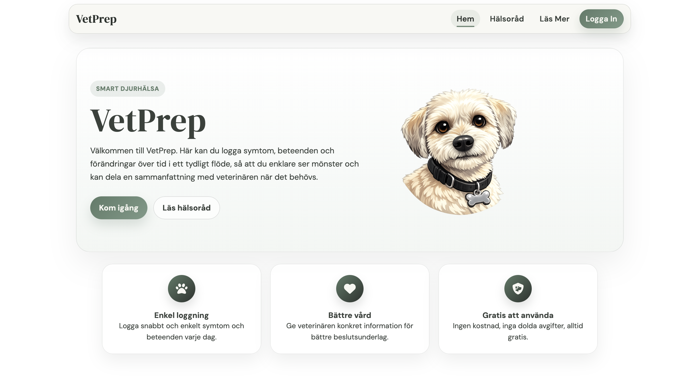
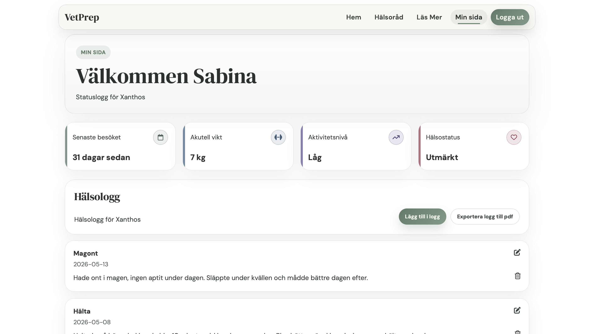

# VetPrep🐹

### Beskrivning
VetPrep är en webbapplikation för djurägare som gör det enkelt att dokumentera och följa sitt husdjurs hälsa över tid. Genom att logga symtom, beteenden och förändringar skapas ett struktuerat underlag som kan delas med veterinär inför besök. 
  
Idén till VetPrep uppstod under en affärsmannaskapskurs och bygger på en personlig erfarenhet av svårigheter att hålla koll på ett djurs sjukdomsförlopp över tid. Projektet utveckls nu vidare med målet att skapa ett modernt, användarvänligt och datadrivet verktyg för både djurägare och veterinärer. 

### Start och användning
Applikationen ligger live på https://shark-app-p84vh.ondigitalocean.app OBS! applikationen visas endast med frontend här, inga backend anrop fungerar. Om du istället vill köra projektet lokalt på din dator med både front och backend, gör såhär:
#### FRONTEND 
- Se till att du har Node.js och npm installerat på datorn
- Du kan antigen klona ner repot eller ladda ner projektet som ZIP från Github och extrahera det, öppna sedan projektet i din kodeditor och öppna terminalen
- Installera beroenden: npm install (OBS! se till att du är inne i frontend mappen, du kan navigera till den genom att skriva "ls" och sedan "cd frontend" i terminalen)
- Starta server: npm run dev
- Öppna applikationen i webbläsaren via den adress som visas i terminalen (oftast http://localhost:5173)
#### BACKEND
- Gå in i backend mappen genom att öppna terminalen och skriv "cd backend"
- När du är inne i backend mappen, kör servern genom att skriva in "dotnet watch --urls=http://localhost:5229/" OBS! detta är viktigt eftersom att API anropen hämtar från denna endpoint.  
- Det kommer även att öppnas ett webbläsarfönster med swagger där man även kan testa alla anrop
- Det finns även färdig data i applikationen som man kan testa i frontend genom att navigera till AppDbContext mappen, där finns data för användare med namn, mejl, husdjursnamn och lösenord

#### Hur hänger backend och frontend ihop?
Jag har valt att ha både frontend och backend i samma repo men i seperata mappar. Under utveckling körs backend på http://localhost:5229 och exponerar REST-endpoints i backend/Controllers. Frontend anropar dessa endpoints direkt från komponenter såsom tillexempel LoginForm.tsx och AddToLog.tsx. Observera att databasen är inmemory - data försvinner vid serveromstart. 

### Hur används API:et, vilka endpoint finns? 
Backend har två controllers med följande:  
- UserController: använder GET anrop /api/users för att hämta alla användare. POST /api/users/login används för att logga in användare. POST /api/users/register används för att registrera ny användare. 
- HealthLogController: använder GET anrop /api/healthlogs/{userId} för att hämta alla hälsologgar för en användare, sorterat efter datum, senast först. POST /api/healthlogs lägger till ny hälsologg. DELETE /api/healthlogs/{id} tar bort hälsologgar. 

### Vidareutveckling
Som vidareutveckling för min MVP skulle jag vilja lägga till PATCH anrop för att kunna uppdatera statusloggen för husdjuret, samt lägga till samma funktion för att kunna redigera häslologgar, samt kunna lägga till bilder i hälsologgen. Jag skulle även vilja bygga ut applikationen så att en användare kan lägga till fler djur vid behov. Utöver detta skulle jag även vilja lägga till ett system för påminnelser, exempel "Du loggade magont för 3 dagar sedan - hur mår djuret nu?".